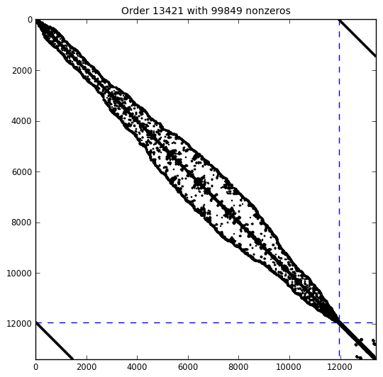

.. Description of linalg module
.. _linalg-page:

==============================================
Direct Solution of Systems of Linear Equations
==============================================

.. _scaling-section:

-----------------------
Scaling a Sparse Matrix
-----------------------

The :mod:`scaling` Module
=========================

.. .. automodule:: scaling

.. todo:: Write Python wrapper.

.. _sils-section:

-------------------------------------------------
Direct Solution of Symmetric Systems of Equations
-------------------------------------------------

The :mod:`sils` Module
======================

.. automodule:: sils

.. autoclass:: Sils
   :show-inheritance:
   :members:
   :inherited-members:
   :undoc-members:

The :mod:`pyma27` Module
========================

.. automodule:: pyma27

.. autoclass:: PyMa27Context
   :show-inheritance:
   :members:
   :inherited-members:
   :undoc-members:

The :mod:`pyma57` Module
========================

.. automodule:: pyma57

.. autoclass:: PyMa57Context
   :show-inheritance:
   :members:
   :inherited-members:
   :undoc-members:

Example
=======

.. literalinclude:: ../../examples/demo_sils.py
   :linenos:

----------------------------------------------------------------
Direct Solution of Symmetric Quasi-Definite Systems of Equations
----------------------------------------------------------------

